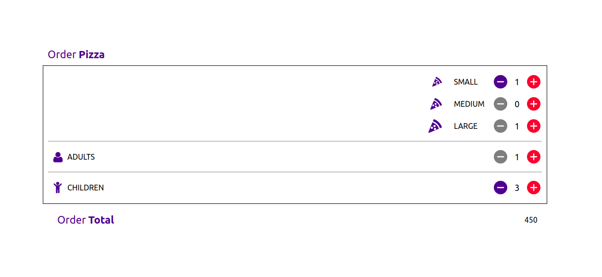

# PIZZA ORDER COMPONENT

## How to run the project online

Open the online demo [here](https://manish-dalal.github.io/pizza-order-component)

## Description

This project was created for an interview as a ReactJS developer, it shows the use of ReactJS and some basic CSS

### Run Localy

1. Clone the repo `git clone https://github.com/manish-dalal/pizza-order-component.git`
2. `npm install` in command line to install dependencies in `package.json`
3. `npm start` Project will launch in the browser

### Example

